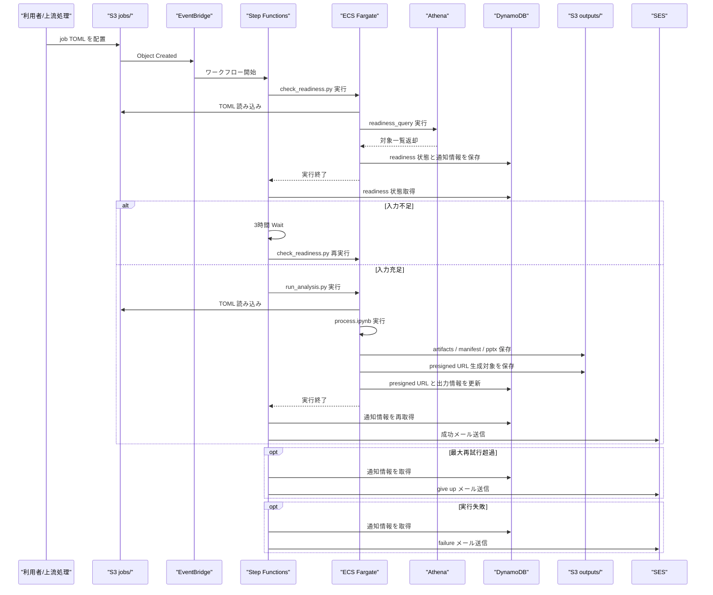

# publish_flow

AWS 上でイベントドリブンな解析パイプラインを構築するための雛形です。

## 構成

- `infra/`: TypeScript CDK アプリケーション
- `engine/`: `uv` 管理の Python 実行基盤
- `reports/`: レポートごとの Notebook とテンプレート
- `misc/`: Notebook から import する共通ヘルパー
- `jobs/`: ジョブ定義サンプルと仕様メモ
- `docs/`: アーキテクチャと運用メモ

## シーケンス図



## クイックスタート

### Infra

```bash
cd infra
npm install
npm run build
npx cdk synth -c stage=staging
```

本番環境の synth は次です。

```bash
cd infra
npx cdk synth -c stage=prod
```

`stage` を省略した場合は `staging` が使われます。

ECS タスクのイメージを既定の公開プレースホルダからローカルの `engine/Dockerfile` に切り替える場合は、次を実行します。

```bash
cd infra
npx cdk synth -c stage=staging -c useDockerAsset=true
```

## 事前準備

### Parameter Store

各 stage で、少なくとも次の Parameter Store 項目を事前に作成してください。

`staging`

- `/publish-flow/staging/network/vpc-id`
- `/publish-flow/staging/network/private-subnet-ids`
- `/publish-flow/staging/network/s3-vpce-id`
- `/publish-flow/staging/network/allowed-cidrs`
- `/publish-flow/staging/notification/from-address`

`prod`

- `/publish-flow/prod/network/vpc-id`
- `/publish-flow/prod/network/private-subnet-ids`
- `/publish-flow/prod/network/s3-vpce-id`
- `/publish-flow/prod/network/allowed-cidrs`
- `/publish-flow/prod/notification/from-address`

推奨する値の形式は次です。

- `vpc-id`: `vpc-xxxxxxxx`
- `private-subnet-ids`: `subnet-a,subnet-b,subnet-c`
- `s3-vpce-id`: `vpce-xxxxxxxx`
- `allowed-cidrs`: `203.0.113.10/32,203.0.113.0/24`
- `from-address`: `noreply@example.com`

### 既存ネットワークの前提

- ECS タスクは既存 VPC の private subnet に配置します
- ECS タスクに public IP は付与しません
- S3 バケットの閲覧は、既存 S3 VPC endpoint 経由または社内 IP/CIDR からのみ許可します
- そのため、既存 VPC 側に S3 VPC endpoint がある前提です

### GitHub Variables

GitHub Actions やローカル `cdk synth` では、SSM lookup の代わりに context で直接渡すこともできます。

- `STAGE=staging`
- `STAGE=prod`
- `VPC_ID=vpc-xxxxxxxx`
- `PRIVATE_SUBNET_IDS=subnet-a,subnet-b,subnet-c`
- `S3_VPCE_ID=vpce-xxxxxxxx`
- `ALLOWED_CIDRS=203.0.113.10/32,203.0.113.0/24`
- `SENDER_EMAIL=noreply@example.com`

例:

```bash
cd infra
npx cdk synth \
  -c stage=staging \
  -c vpcId=vpc-xxxxxxxx \
  -c privateSubnetIds=subnet-a,subnet-b \
  -c s3VpceId=vpce-xxxxxxxx \
  -c allowedCidrs=203.0.113.10/32,203.0.113.0/24 \
  -c senderEmail=noreply@example.com
```

### Engine

```bash
cd engine
uv sync
uv run python app/check_readiness.py --job ..\jobs\examples\inventory_report.toml
uv run python app/run_analysis.py --job ..\jobs\examples\inventory_report.toml
```

## 補足

- `check_readiness.py`、`run_analysis.py`、各レポートの Notebook はダミー実装です。
- `template.pptx` はプレースホルダなので、既存実装の実ファイルに差し替えてください。
- Step Functions は `Standard` を使うため、待機ループ中に ECS タスクは保持されません。
- staging / prod は同一 AWS アカウント内で分離し、主要な物理名は `publish-flow-<stage>-<resource>` 形式で統一します。
- 本番は保護を強めるため、主要ストレージ系リソースは `Retain` を使い、スタックの termination protection も有効にします。
- S3 の閲覧制限は `SourceVpce` と社内 CIDR の両方を使って制御します。
- 通知メールは SES を使い、送信元は Parameter Store または `senderEmail` context で指定します。
- 通知先と件名は、S3 に置かれる実ジョブ TOML の `[notification]` から読み取ります。
- readiness 判定は Athena の `readiness_query` を実行して行います。既定の workgroup は `primary` です。
- 成果物の出力先は `outputs/<type_name>/<purpose>/<job_id>/...` に統一します。
- `type_name` と `purpose` は日本語を使わず、英小文字・数字・`-` / `_` の slug として運用します。
- `analysis_targets` の件数に応じて、解析用 Fargate タスクは 4 段階で自動的に切り替わります。
  - `small`: 1-5 件, `4 vCPU / 30 GiB`
  - `medium`: 6-20 件, `8 vCPU / 60 GiB`
  - `large`: 21-50 件, `16 vCPU / 80 GiB`
  - `max`: 51 件以上, `16 vCPU / 104 GiB`
- この切り替えは `check_readiness.py` が TOML を読んだ時点で判定し、Step Functions が該当サイズの task definition を選びます。
